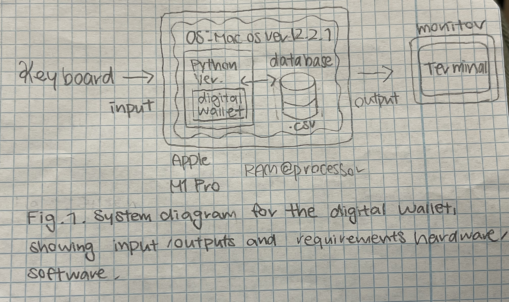
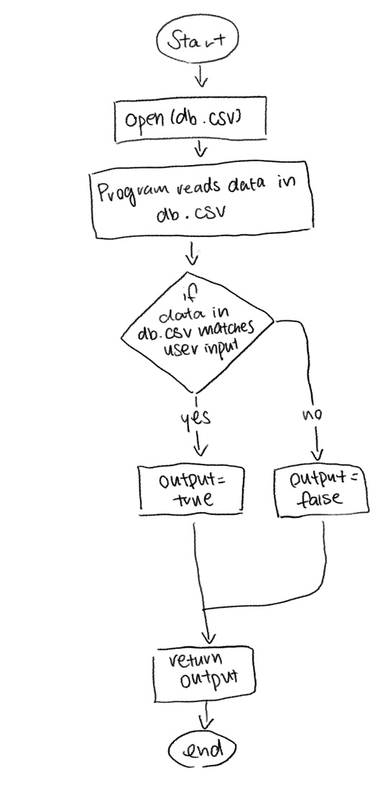
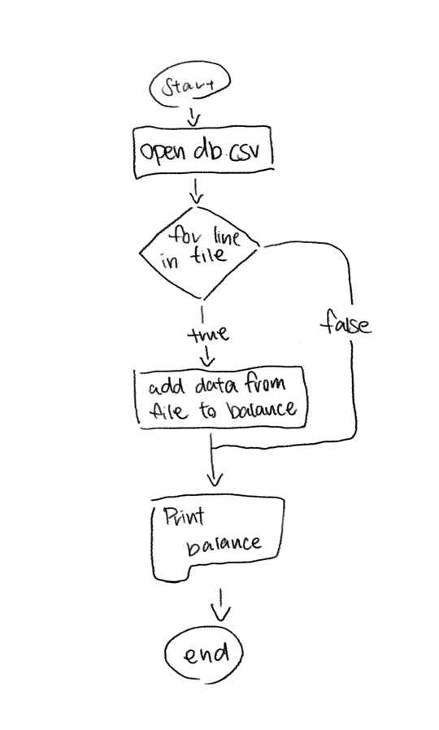
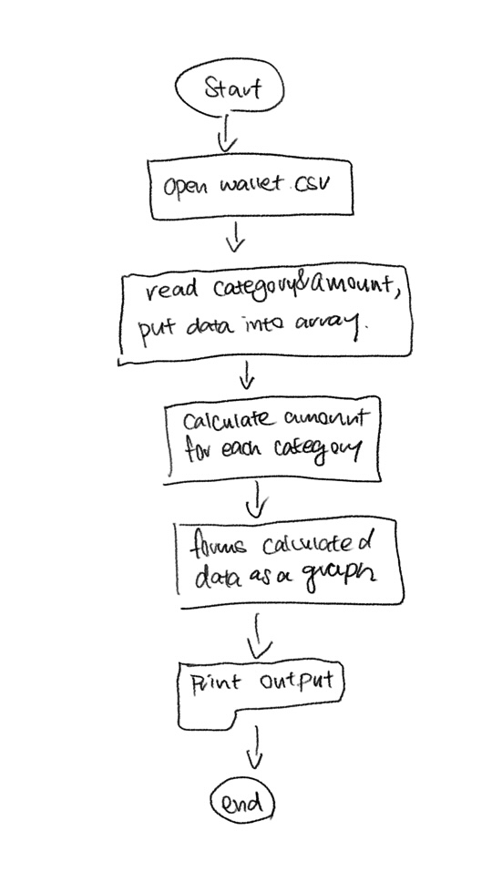

# Crypto Wallet


<sub>(Source: https://geekflare.com/wp-content/uploads/2019/11/Wallet.gif)<sub>

# Criteria A: Planning
## Problem definition
Ms. Sato is a local trader who is interested in the emerging market of cryptocurrencies. She has started to buy and sell electronic currencies, however at the moment she is tracking all his transaction using a ledger in a spreadsheet which is starting to become burdensome and too disorganized. It is also difficult for Ms Sato to find past transactions or important statistics about the currency. Ms Sato is in need of a digital ledger that helps her track the amount of the cryptocurrency, the transactions, along with useful statistics.

Apart for this requirements, Ms Sato is open to explore a cryptocurrency selected by the developer.


## Proposed Solution
Design statement: I will to design and make a program for a client who is a trader. The program will be about crypro currencies and is constructed using the software pycharm. It will take 3 weeks to make and will be evaluated according to the criteria A and B.

Justify the tools/structure of your solution: I will be using Python for this solution because it provides easy data scraping functions and various libraries which could help in providing useful statistics to Mr Sato

I will be using Polkadot as my currency for this solution.

### Polkadot currency
Polkadot will enable a completely decentralized web where users are in control. Polkadot is built to connect private and consortium chains, public and permissionless networks, oracles, and future technologies that are yet to be created. Polkadot facilitates an internet where independent blockchains can exchange information and transactions in a trustless way via the Polkadot relay chain. Polkadot makes it easier than ever to create and connect decentralized applications, services, and institutions. By empowering innovators to build better solutions, we seek to free society from its reliance on a broken web where its large institutions can’t violate our trust.
(https://polkadot.network/about/)


## Success Criteria
1. The electronic ledger is a text-based software (Runs in the Terminal).
2. The electronic ledger display the basic description of the cyrptocurrency selected.
3. The electronic ledger allows to enter, withdraw and record transactions.
4. Show the wallet balance
5. Password
6. Show a graph by category

## Test Plan
| Description                           | Type           | Inputs                                                                                                                                                                                                                                                                                                                                                                      | Outputs                                                                                                                                            |
|---------------------------------------|----------------|-----------------------------------------------------------------------------------------------------------------------------------------------------------------------------------------------------------------------------------------------------------------------------------------------------------------------------------------------------------------------------|----------------------------------------------------------------------------------------------------------------------------------------------------|
| Login & Menu                          | Unit test      | 1. Run the Project1.py  2. Input "sam" as Username & "234" as Password                                                                                                                                                                                                                                                                                                      | If the username and password matches what's stored in the user.csv file. It will transition user to the landing page which shows a menu of options |
| View basic description of Crypto      | Unit test      | 1. User put in "1" into prompt following the menu                                                                                                                                                                                                                                                                                                                           | Print the basic description of the crypto that the ledger is based on                                                                              |
| Enter, Withdraw, Record a Transaction | Unit test      | 1. User put in "2" into prompt following the menu<br/>  2. User inputs a number from 1 to 3 to select the function they want(enter, withdraw or record) or 4 to return to the main menu<br/>   3.User inputs amount of crypto changed(e.g : 1)<br/>   4. User inputs the date of transaction(e.g : 2022-07-09)<br/> 5. User inputs the category of transaction(e.g: Travel) | The program writes the data into the CSV file and prints a line saying action completed successfully                                               |
| View wallet balance                   | Unit test      | 1. User put in "3" into prompt following the menu                                                                                                                                                                                                                                                                                                                           | Prints the balance of the wallet from the wallet.csv                                                                                               |
| View Spending Graph                   | Unit test      | 1. User put in "4" into prompt following the menu                                                                                                                                                                                                                                                                                                                           | Program will read data from CSV file and print a graph of spending depending on category                                                           |
| Number input validation               | Usability test | 1. User input invalid characters(e.g : abc) into the prompt when asked to put in number(either int/float)                                                                                                                                                                                                                                                                   | Program prompts user that the input is invalid and prompts user to input again.                                                                    |
| Login System                          | Usability test | 1. User inputs wrong username(e.g: bob)/password(e.g : dabuilder) when logging in                                                                                                                                                                                                                                                                                           | Program prompts user to retry logging in.                                                                                                          |


# Criteria B: Design
## System Diagram

*Fig.1* **System diagram of this program**

## Flow Diagrams

### Login


*Fig.2* **Flow diagram of the login function**

### Wallet Balance


*Fig.3* **Flow diagram of the wallet balance function**

### Graph


*Fig.4* **Flow diagram of the graph function**

## Record of Tasks
| Task No | Planned Action             | Planned Outcome                                                                          | Time estimate | Target completion date | Criterion |
|---------|----------------------------|------------------------------------------------------------------------------------------|---------------|------------------------|-----------|
| 1       | Create system diagram      | To have a clear idea of the hardware and software requirements for the proposed solution | 10min         | Oct 2                  | B         |
| 2       | Interview with the Client  | To discuss client's needs and define success criteria                                    | 5min          | Sep 23                 | A         |
| 3       | Code the Menu              | To have menu items and title written on the screen                                       | 20min         | Sep 23                 | C         |
| 4       | Code authentication system | A tested program to protect the application using a password with encryption             | 60min         | Sep 27                 | C         |
| 5       | Code Main Functions        | A function base of the program                                                           | 6hrs          | Oct 9                  | C         |
| 7       | Form Test Plan             | To a flexible test plan formed                                                           | 30min         | Oct 9                  | B         |
| 8       | Draw Flow Diagrams         | To have completed the flow diagrams for the functions of the program                     | 1hr           | Oct 9                  | B         |


# Criteria C: Development

## Techniques Used:
1. Functions
2. For/while loops
3. Input Validation
4. If/then/else statements
5. Interacting with CSV files


## Login Function
```.py
def login(user:str, password:str)->bool:
    '''
    Function for a simple user login
    needs db.csv
    :param user: string
    :param password: string
    :return: true or false
    '''

    with open("db.csv") as file:
        database = file.readlines()
    output = False
    for line in database: #every user
        #get rid of \n
        clear_line = line.strip()
        separated_line = clear_line.split(",")
        if user == separated_line[0] and password == separated_line[1]:
            output = True
    return output
```

The code above is the login function. It takes the user and password as parameters and checks if the user and password are in the database. If the user and password are in the database, it returns true. If the user and password are not in the database, it returns false.

## Wallet Balance Function
```.py
    elif option == 3:
        print(f"{bold_green}3. Showing wallet balance{end_code}")
        balance = 0
        with open("wallet.csv","r") as file:
            wallet = file.readlines()
            i = 0
            for line in wallet:
                if i > 0:
                    data = line.split(",")
                    balance += float(data[1])
                i += 1
            temp = f"You currently have {balance} {crypto_name} in your wallet."
            print(temp)
```

The code quoted above is the wallet balance function. It takes the wallet.csv file and reads it. It then adds up all the transactions and displays the total amount of the cryptocurrency in the wallet.

## Graph Function
```.py
 elif option == 4:
        category = []
        category_amount = []
        print(f"{bold_green}4. Showing graph{end_code}")
        with open("wallet.csv", "r") as file:
            wallet = file.readlines()
            i = 0
            # skip first csv line
            for line in wallet:
                if i > 0:
                    data = line.split(",")
                    if data[2] not in category:
                        category.append(data[2])
                        category_amount.append(float(data[1]))
                    else:
                        category_amount[category.index(data[2])] += float(data[1])
                i += 1
            # print a bar graph for each category
            for i in range(len(category)):
                print(f"{category[i]}: {category_amount[i]}")
                print("■" * int(category_amount[i] / 10))
```

This code is the graph function. It takes the wallet.csv file and reads it. It then adds up all the transactions by category and displays a bar graph of the total amount of the cryptocurrency in the wallet by category.
